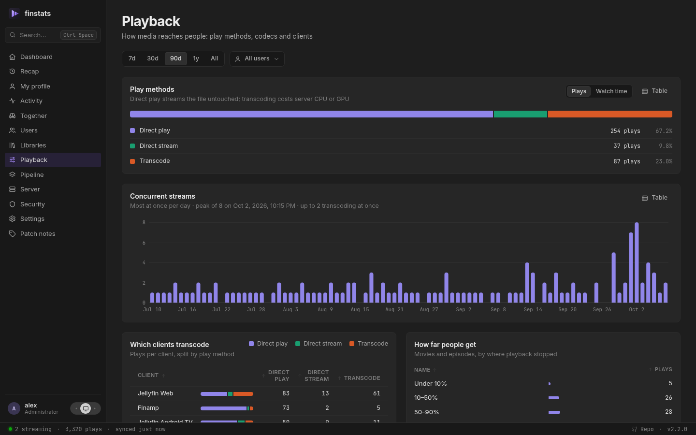
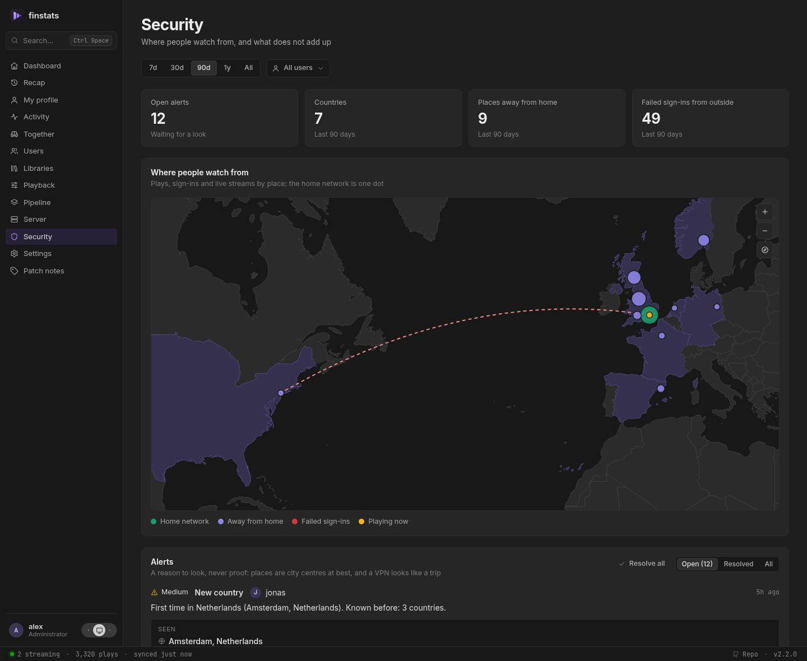
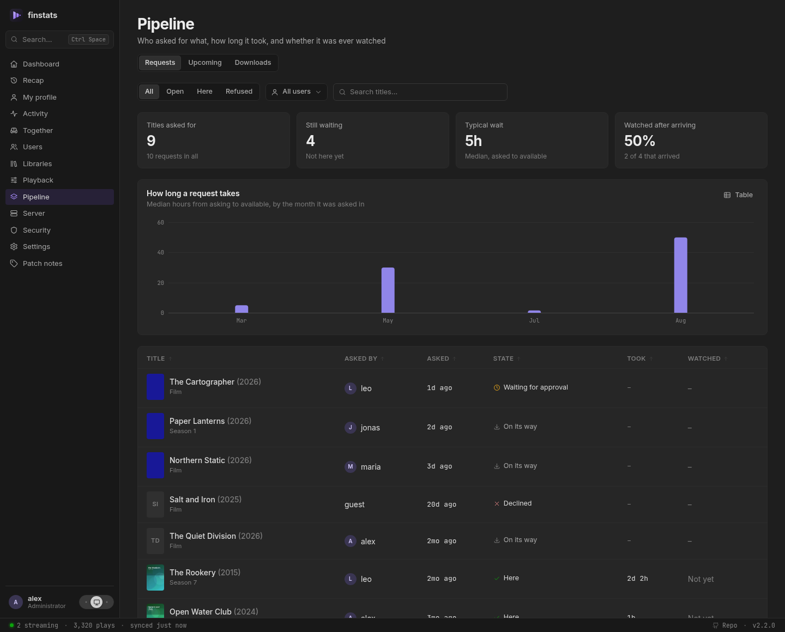
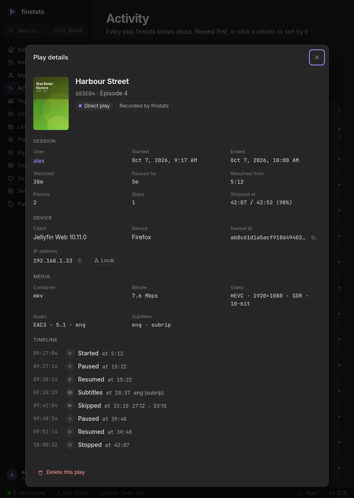
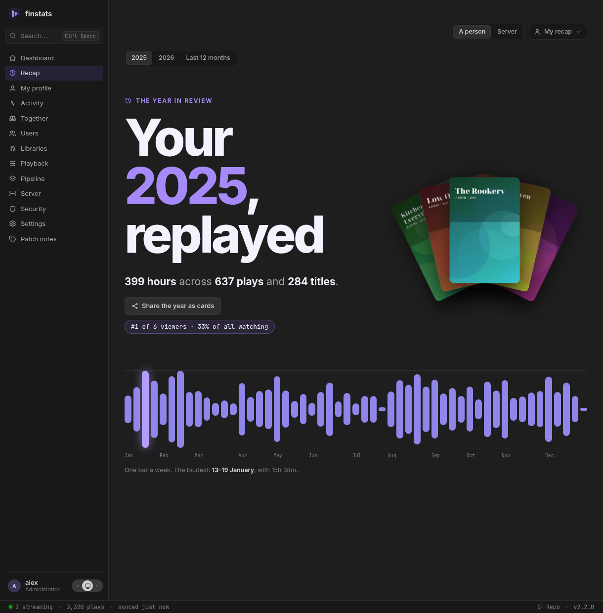

# What you get

## A live view of your server
See every stream as it happens: who, what, on which device and from where, whether it plays
directly or transcodes, and why. A status bar keeps the essentials in sight on every page.

## Answers, not just charts



- **How busy does it get?** Peak concurrent streams over time, and how many of them transcode.
- **Which apps cause transcoding?** Every client, split by direct play, remux and transcode, with the reasons Jellyfin reports.
- **How much leaves the house?** Local versus remote plays and an estimate of data streamed. finstats knows your
  household's public address, so a phone on the Wi-Fi that goes through your public name still counts as home.
- **Do people finish what they start?** See how far viewers get before they stop.
- **Where do people give up?** Every film and episode draws the shape of it: the share still watching at each minute,
  so "68% stop at four minutes" reads as an opening-credits problem and a show says which episode people never come
  back after.
- **Where do people rewind, and when do the subtitles go on?** On the same chart: the spot several people skipped
  back to is where the dialogue is mumbled, and subtitles going on three minutes in is a finding about that file.
- **Which files are broken?** A title started three times that never got past thirty seconds is a bad remux or a
  missing codec, and finstats says which apps tried, before a family member has to tell you it doesn't work.
- **Want it in a different order?** Every table sorts by any column with a click, and long ones can be filtered as you type.
- **Is it dubbed?** Every title shows the languages of its audio and subtitle tracks. A show says how far a dub goes
  ("English: 13 of 26 episodes"), and each episode lists its own, so you know before you start.
- **What is my library made of?** Resolutions, codecs, HDR, size per decade, what was added when,
  and the big one: **titles nobody has ever watched**, sorted by how much space they take.

## Is the library in order?
**Server → Library health** compares every file with its neighbours and lists what stands out, each with the numbers
that say so: episodes missing in the middle of a season, a season in another resolution than the rest of the show, one
720p episode in a 1080p season, the same film twice (and the space it takes), a file far too thin for the resolution it
claims, a dub that covers two seasons and not the third, and titles Jellyfin never matched with a catalogue. Set aside
what is fine on purpose, with a note; it comes back by itself if the files change. finstats only reports: it never
deletes, rescans or fixes anything.

## Is that really them?



The **Security** page puts every play and sign-in on a world map: home is one dot, places away from
home another colour, streams running right now pulse, and failed sign-ins from outside show up in red.
When an account is somewhere it cannot be (home at eight, another continent twenty minutes later, or
two places at once), finstats raises an *impossible travel* alert with both sightings, the distance and
the speed it would have taken; the first time someone shows up in a new country is flagged too. Mark a
VPN or a holiday as fine and it stays quiet. Addresses are looked up in a database file on your own
machine and the map is drawn by finstats itself, so no address or coordinate is sent anywhere.

## What is coming in



finstats can also watch the rest of your setup, read-only: **Sonarr**, **Radarr** and **Seerr**, several of a kind if you
have them. Your download client needs no setup of its own: Sonarr and Radarr already talk to it, and finstats reads what
they know. The **Pipeline** page then answers the questions statistics alone cannot:

- **Was it worth getting?** Every request with who asked, how long it took to arrive, and whether they ever watched it,
  plus the list nobody likes to see: what arrived weeks ago and has never been played.
- **What is coming?** A calendar of new episodes and film releases, marked with who is actually watching that show, so a
  Friday episode of something three people follow stands out from one nobody has touched in a year.
- **What is arriving right now?** The live queue with progress, speed and what went wrong on import, plus what came in
  over the last week, month or year, by indexer, quality and download client.

Your own requests are yours to see; other people's need a permission, and the download queue another. API keys are stored
in finstats' own database, are never shown again, and are never part of a backup.

## Every play, down to the pause button



Other tools store one line per play. finstats records what happened *during* it: every pause and
resume, every skip, audio and subtitle switches, the moment a direct play turned into a transcode,
where playback picked up and where it stopped.

Alongside the usual details: device, app version, IP address and whether it was on your network,
video and audio format, bitrate, time watched versus time paused.

Every film and show lists its cast and crew, and every actor and director has a page of their own:
what they are in on your server, and how much of it has been watched.

Renamed a file? Jellyfin treats it as a new item and orphans its history. finstats notices and
re-attaches the old plays to the new entry.

## Who watches together
When two or more people press play on the same thing at the same time, finstats notices: which
groups watch together, what they watch, and how many hours they have spent doing it. It shows on
the dashboard, on each profile ("most often with"), and as a small mark on every shared play. The
**Together** page has the whole of it: who watches with whom, hours in company against hours alone
over time, each person's share, and the recent evenings. An evening of three counts for each of its pairs.

## Use it from outside
Everything the pages know, a script can ask. Make a key under **Settings → API keys** and send it as a header:

```sh
curl -H "Authorization: Bearer fs_…" https://finstats.example/api/stats/overview?days=30
```

A key is you: it sees what you may see and no more, dies when your access does, and is shown once. Make one
with the *calendar* scope and your phone can subscribe to **what is coming**: every episode and film Sonarr
and Radarr expect, as a calendar you carry with you, without that key opening anything else. And every change
made in finstats (a sign-in, a setting, a key, a backup, an import) is on record under **Server → Audit**,
with who did it and from where.

## Where you are in every show
Your profile shows each series as a bar with one segment per episode: seen, started, or not yet.
Only episodes that are actually on your server count, so an announced season does not spoil a
finished show. Watched something while nothing was recording? Jellyfin's own played marks fill the
gap, and you can mark episodes, seasons or whole shows as seen yourself. Alongside it: your longest
and current day streak.

<br clear="right">

## A watchlist of your own
Put a film or a show on your watchlist from its page (an episode's page offers its show), from Upcoming, from Recently added or from search,
even one that is not on your server yet, straight from what Sonarr or Radarr is waiting for. Every entry
says where it stands now: on the server, 5 of 26 episodes, requested, coming up Friday, or watched. When
something you were waiting for arrives, finstats can tell you. Nobody else sees your list, an administrator
included, and nothing is written to Jellyfin, Seerr, Sonarr or Radarr.

## Your year in review



A personal recap for every user, in the spirit of Spotify Wrapped: hours watched, top shows, movies,
music and genres, the actors and directors you spent the most time with, and a viewing
personality: night owl, weekend warrior, binge watcher and more. See the whole year as a calendar
of days, find out which weekday took the crown, and collect the records worth bragging about:
biggest binge, longest daily streak, most rewatched title, the oldest film you watched. Since 2.0 it
also tells you who you watched with, which shows you finished (and which you left for later), what you
asked for through Seerr and what came of it, and how the year compares with the one before.

**Share it as a story.** Every chapter is also a 1080×1920 card, the shape phone stories use: save one,
or all of them as a ZIP. A card never names anybody else: the people you watched with are named in
the app and nowhere that leaves it. Publish your year on your public profile and anyone with the link
sees the same cards. In December, when the year is ready, finstats can tell you so.

Each person sees only their own. Administrators can open another person's recap, and the whole server's
year (titles and totals, nobody ranked or named); nobody else can, whatever permissions they hold.

## Share it, if you want to

A person can publish part of their profile at a link that opens without an account (totals and top
titles, streaks and when they watch, the year, the last few plays), and every link comes with a card
that chat apps show when it is pasted. It is off until an administrator allows it, each part is off
until its owner turns it on, and nothing on it is newer than a day, so a published page never says
who is watching right now. Devices, addresses, apps and file paths are never published, whatever is
switched on. The link is random, and resetting it is how you take back one already sent.

