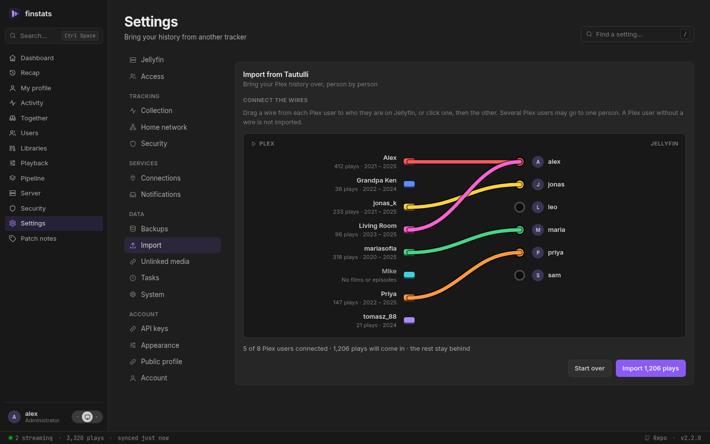

# Bringing your history

Coming from Jellystat, Streamystats or Tautulli? Your history comes with you, from any of them.

**Jellystat:**

1. Open **Settings → Backup**
2. Select only **Activity** (it turns purple)
3. Under settings click **Settings**, scroll to the end and start a backup
4. Go back to **Backups**, open **Actions** on the new backup and click **Download**

**Streamystats:** open **Settings → Backup & Import**, scroll down to **Backup & Restore** and
click **Download Backup**.

**Tautulli** (coming from Plex):

1. Open **Settings → Import & Backups** and click **Backup Database**. Tautulli saves the backup on
   the machine it runs on; nothing downloads to your browser.
2. Find it in Tautulli's `backups` folder, inside its data folder. With Docker that is `backups` inside
   the folder you mounted as `/config` (for example `/opt/tautulli/config/backups`); with a native
   install, inside the data folder Tautulli was installed with.
3. Take the newest `tautulli.backup-….db` or `….db.zip` (the scheduled ones, `….sched.db.zip`, work
   the same). Leave the `config.backup-…` files: they are Tautulli's settings, not its history.
4. Copy it to the computer you are using, with `scp`, a shared folder or your NAS's file manager.

In FinStats, open **Settings → Import**, find the card for the one you used, and drop the file in.

**From Tautulli you say who is who.** Plex names rarely match Jellyfin's, so the upload becomes a
wiring board: Plex users on one side, Jellyfin users on the other. Drag a wire from each Plex user to
who they are now, or click one, then the other. Anybody you leave unwired is not imported, and two
Plex accounts can go into one person. Films and episodes are matched to your library by name; music
is left out. Anything it cannot place (a film Plex called something else) waits under **Settings → Unlinked media**
with its likeliest match already found, one **Locate** away.

**Ran both?** Import both files. Nothing is counted twice: FinStats recognises a play it already
has, whichever tracker brought it in and whether or not it watched that evening itself.

Large backups are no problem (a 350 MB file imports in a few seconds), and importing the same file
twice is safe. One thing to know: neither tracker recorded what happens *during* a play, so imported
history has no pause-and-skip timelines. Everything FinStats records from now on does.
[How Jellystat data is interpreted →](jellystat.md) ·
[How Streamystats data is interpreted →](streamystats.md) ·
[How Tautulli data is interpreted →](tautulli.md)

