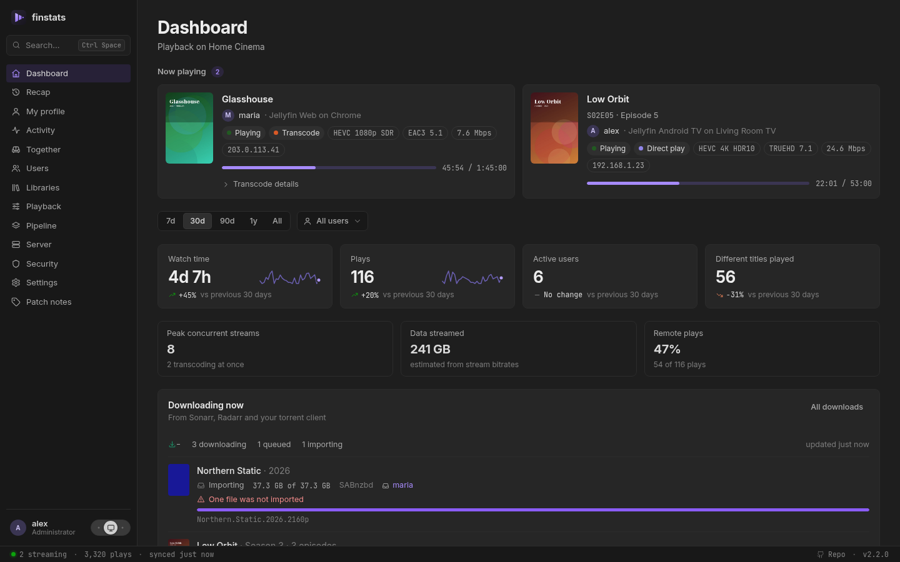

# finstats

**See what your Jellyfin server is really doing.** Who is watching, what they watch, how it streams, and your year in
review. One tiny container. No database server. Set up in two minutes.

[Try the demo](https://finstats.no/): finstats in your browser, with invented people and titles.
Nothing to install.

!!! note "How finstats is built: with AI assistance"
    Most of the code was written by Claude Code, working from the maintainer's design decisions and reviewed before it
    landed. Nothing is generated and forgotten: every change is written test-first, `cargo test` runs in CI on every
    push to `main` and on every release tag, and each release is run against a real Jellyfin server before it ships.
    Said plainly because you should know what you are running; the responsibility for this code is the maintainer's,
    not a model's.

## Why finstats

Jellyfin tells you what is playing right now. It does not tell you that one client transcodes everything it touches,
that four people stream at once every Saturday, or that a third of your disk is films nobody has ever pressed play on.

finstats watches your server quietly in the background and turns that into answers. It is a lightweight alternative to
Jellystat and Streamystats: a single small program with its own built-in database, using **under 100 MB of memory**,
where each of those needs around half a gigabyte. Nothing else to install, nothing to maintain.

Already using Jellystat or Streamystats, or coming from Plex with Tautulli?
[Bring your history with you](imports/index.md). It takes seconds.

## Where to go next

- [Get started](install.md): one `docker run`, then two steps in the browser.
- [What you get](features.md): every page and the questions it answers.
- [Privacy](privacy.md): what finstats keeps, who sees it, and the one request it makes by default.
- [Settings](settings.md): everything you can tune, and the environment variables.
- [Updating and moving](updating.md), and [questions people ask](faq.md).
- [The security model](security.md) and [how to report a vulnerability](reporting-security.md).
- For developers: the [HTTP API](api.md) and [contributing](contributing.md).

## License

finstats is free software under the
[GNU General Public License v3.0](https://github.com/finstats/finstats/blob/main/LICENSE). You may use, study, share and
change it; if you distribute a modified version, it has to stay under the same license with its source available. It
comes with no warranty.

The bundled fonts (Inter and JetBrains Mono, and those a FinUI preset may choose in Settings → Appearance) are under the
SIL Open Font License 1.1; each one's licence sits beside it in
[`web/assets/fonts`](https://github.com/finstats/finstats/tree/main/web/assets/fonts) and is listed on the in-app
Licences page.

<small>Screenshots show generated demo data: invented users, titles and artwork.</small>
